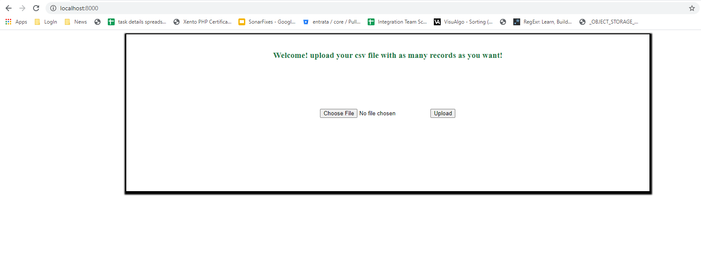
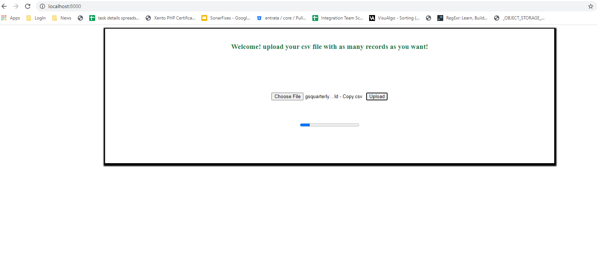
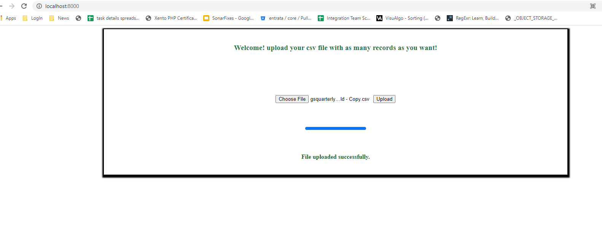

# Upload Large CSV

1. Upload large CSV using laravel Job Queue
2. To Start this project execute `php artisan serve` command from terminal/cmd
3. Create the database with name - `file_details`
4. Execute `php artisan:migrate` command to create all the tables
5. To start the queue execute `php artisan queue:work` command
6. Hit the url - `http://localhost:8000/` to get started
7. Now you are good to use the project.

## Steps to follow - 

----------------------------------------------------------------------------------------------------------

----------------------------------------------------------------------------------------------------------

----------------------------------------------------------------------------------------------------------

